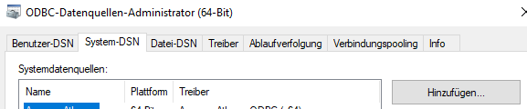
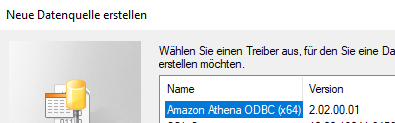
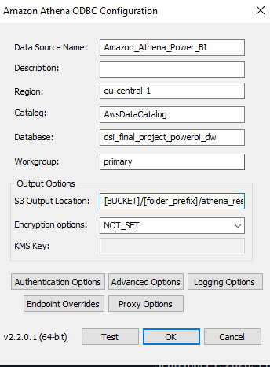
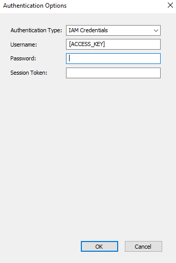
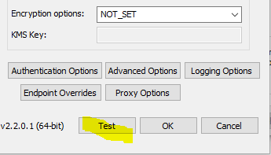
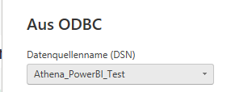
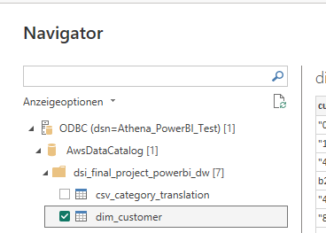

# Connect Athena Views with Power BI Desktop (local)

**Before you start:**
This manual describes the order of steps to connect Power BI desktop in a German Windows environment

## 1. Download Driver ODBC 2.3.0.0 for Windows amd64

https://downloads.athena.us-east-1.amazonaws.com/drivers/ODBC/v2.3.0.0/Windows/AmazonAthenaODBC-2.3.0.0-windows-amd64.msi

## 2. Search in Windows Search Bar for "ODBC-Datenquellen (64-Bit)"

[System-DSN/Hinzufügen]

## 3. Choose the driver you have already downloaded

## 4. Complete the required fields

**requierd fields:**

Data Source Name: [choose your name for System-DSN]

Region: [region of your environment]

Catalog: [AWS Glue Data Catalog name]

Database: [Athena Database name]

Workgroup: [if you didn't create a specific Workgroup in AWS, the default ist "primary"]

S3 Output Location: [URI of the folder, where Athena writes the query results]

## 5. Authentification

**required fields:**

Authentification Type: IAM Creditials

Username: [ACCESS_KEY] of the System-User works with ODBC Driver (seperate IAM-User with specific Policy)

Password: SECRET_ACCESS_KEY

## 6. Test Connection

## 7. Power BI Connection

**Search for data source "ODBC" and choose "ODBC Andere"**

use the Data Source Name you configured in "ODBC-Datenquellen (64-Bit)"

**Select the tables you want to load into semantic model**

--> "Laden"
